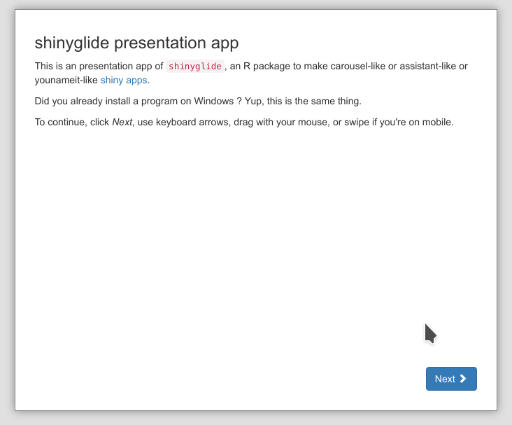

# shinyglide

<!-- badges: start -->
[](https://www.tidyverse.org/lifecycle/#experimental)
[](https://cran.r-project.org/package=shinyglide)
[](https://travis-ci.org/juba/shinyglide)
<!-- badges: end -->

`shinyglide` is an R package which provides carousel-like or assistant-like components to [shiny](https://shiny.rstudio.com) applications, thanks to the [Glide](https://glidejs.com) JavaScript library.

It allows to create this sort of app ([live example](https://data.nozav.org/app/shinyglide/01_presentation/)) :



Or can be integrated into an existing app to create an "assistant-like" interface ([live example](https://data.nozav.org/app/shinyglide/03_modal/)):


The package is still in experimental stage, breaking changes could happen.


## Features

- Responsive, navigation by mouse, keyboard, dragging, swiping
- Controls are completely customizable ([live example](https://data.nozav.org/app/shinyglide/04_custom_controls/))
- *Next* and *Back* controls can be disabled until an input condition is met (same syntax as `shiny::conditionalPanel`)
- "Screens" can be generated or hidden depending on user inputs. Loading time are taken into accounts (disabled *Next* button and customizable animation)
- Integration with Shiny modal dialogs ([live example](https://data.nozav.org/app/shinyglide/03_modal/))
- Multiple glides per app ([live example](https://data.nozav.org/app/shinyglide/05_multi_glides/))

## Installation

The package is not on CRAN yet. You can install the development version with :

```r
remotes::install_github("juba/shinyglide")
```

## Usage

A `shinyglide` component is created with the `glide()` function. This component is then divided intro *screens* with the `screen()` function. 

Here is the code of a very basic app ([live example](https://data.nozav.org/app/shinyglide/02_simple/)):

```{r}
library(shiny)
library(shinyglide)

ui <- fixedPage(style = "max-width: 500px;",
  titlePanel("Simple shinyglide app"),

  glide(
    height = "350px",
    screen(
      p("This is a very simple shinyglide application."),
      p("Please click on Next to go to the next screen.")
    ),
    screen(
      p("Please choose a value."),
      numericInput("n", "n", value = 10, min = 10)
    ),
    screen(
      p("And here is the result."),
      plotOutput("plot")
    )
  )
)


server <- function(input, output, session) {

  output$plot <- renderPlot({
    hist(
      rnorm(input$n),
      main = paste("n =", input$n),
      xlab = ""
    )
  })

}

shinyApp(ui, server)

```


For more information, see the three available vignettes :

- [Introduction to shinyglide](https://juba.github.io/shinyglide/articles/a_introduction.html)
- [Conditional controls and screen output](https://juba.github.io/shinyglide/articles/b_conditionals.html)
- [Custom controls](https://juba.github.io/shinyglide/articles/c_custom_controls.html)


## Credits

- `shinyglide` is based on the [Glide](https://glidejs.com/) JavaScript library, by [Jędrzej Chałubek](https://github.com/jedrzejchalubek).
